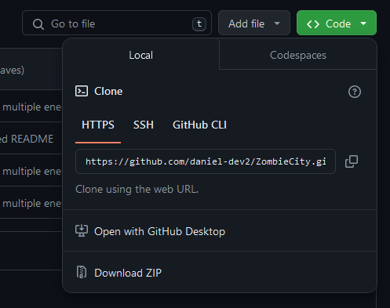

# Zombie City

Zombie City é um jogo curto feito em Python utilizando a biblioteca Pygame.

## Controles

W - mover para cima   
S - mover para baixo  
A - move para a esquerda  
D - move mover para a direita

## Instalação

Para rodar Zombie City será necessário ter [Python](https://www.python.org/) e a biblioteca [Pygame](https://www.pygame.org/news) instalados no seu computador. Certifique-se de checar a opção "Add python to PATH".


Após ter instalado python, ou se você já o tem instalado, abra o prompt de comando e digite o código a seguir: 
### Windows
```sh
py -m pip install -U pygame --user
```
### Mac

```sh
python3 -m pip install -U pygame --user
```

### Debian/Ubuntu/Mint
```sh
sudo apt-get install python3-pygame
```

Então, baixe o repositório no seu computador e execute o arquivo main.py. Talvez seja necessário executar o arquivo main.py mais de uma vez para a compilação do código.  
